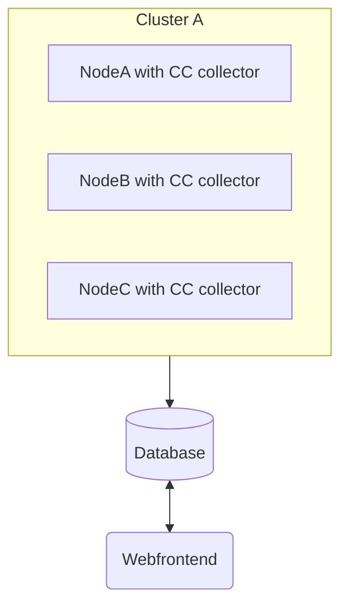

# arthur-miguel.github.io

## Teste 1

```mermaid
flowchart TD
  subgraph a ["Cluster A"]
  nodeA[NodeA with CC collector]
  nodeB[NodeB with CC collector]
  nodeC[NodeC with CC collector]
  end
  a --> db[(Database)]
  db <--> ccweb("Webfrontend")
```

### Teste 2

blabla
